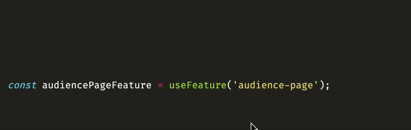

  

# Unrevealed

[Unrevealed](https://unrevealed.tech) is the feature management solution for developers who want to deliver more value to their customers, and worry less about their feature flags.

This VS Code extension adds context to your features directly into your codebase.

