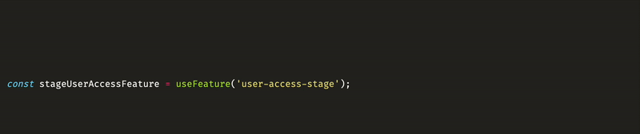

# Unrevealed

[Unrevealed](https://unrevealed.tech) is the feature management solution for developers who want to deliver more value to their customers, and worry less about their feature flags.

This VS Code extension adds context to your features directly into your codebase.



## Getting started

This extension needs to connect to Unrevealed to work properly.

1. Login to Unrevealed

Open the command palette (`cmd + shift + p`), search for `Unrevealed` and select `Unrevealed: Login`

2. Configure your workspace

This extension relies on `unrevealed.config.json` to load your features. You can use the [Unrevealed CLI](https://www.npmjs.com/package/unrev) to generate it for the first time

```bash
npx unrev init
```

## Usage

Once configured, whenever you hover the key of a feature that exists un Unrevealed, you'll see details about that feature: its name, current stage, description, and a link to open that feature on Unrevealed.

## Reloading the extension

This extension fetches features only once by default. When making changes to `unrevealed.config.json`, or if you've created new features on Unrevealed after opening VS Code, you can reload that list by running the `Unrevealed: Reload features` from the command palette.
